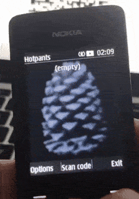

# Hotpants
## A HOTP/TOTP one time password generator for feature phones

A J2ME Java application to manage your two-factor authentication with your dumbphone on the go.

## Screenshots

## Installation
[Download the .jar file of the latest release](/releases) and copy it to your phone (Bluetooth, USB…) and you should be ready to go.

## Usage
You can import both TOTP (time-based one time passwords) and HOTP (counter based one time passwords). You can **scan the QR code** or enter the details manually.

When using TOTP, make sure the date and time of your phone are exactly correct, otherwise the codes will not work. You can shift the time by a couple of seconds in the menu item "Time Configuration".

When using HOTP, just select the entry an click "New Pin" to generate the next code.

## Credits
OTP PIN calculation from [Evsinev](https://github.com/evsinev/j2me-hotp).
QR Code Scanner from [OnlineCity](https://github.com/onlinecity/oc-qrreader).
Thank you @lionkmp for testing!
