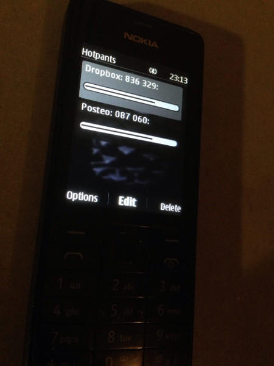
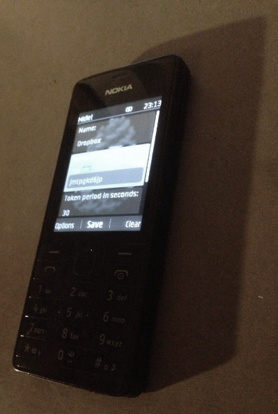

# Hotpants
## A HOTP/TOTP one time password generator for feature phones

A J2ME Java application to manage your two-factor authentication with your dumbphone on the go.

## Screenshots

## Installation
Head over to [releases](/releases) and download the .jad or .jar file. Copy it to your phone (Bluetooth, USB…) and you should be ready to go.

## Usage
Just add HOTP and TOTP providers, either manually or **scan a QR code**. Then, you can simply read the temporary TOTP timepad password or the current HOTP password!
When using HOTP, just select the entry an click "New Pin".

Because some phones only allow for manual time setting by the minute, and TOTPs require exact timing by the second, you can set an offset on the seconds of the phone's time in the menu item "Time Configuration".

## Todo

* Validate secret
* Make hashing algorithm selectable (SHA1 at the moment)

## Credit
OTP PIN calculation from [Evsinev](https://github.com/evsinev/j2me-hotp).
QR Code Scanner from [OnlineCity](https://github.com/onlinecity/oc-qrreader).
